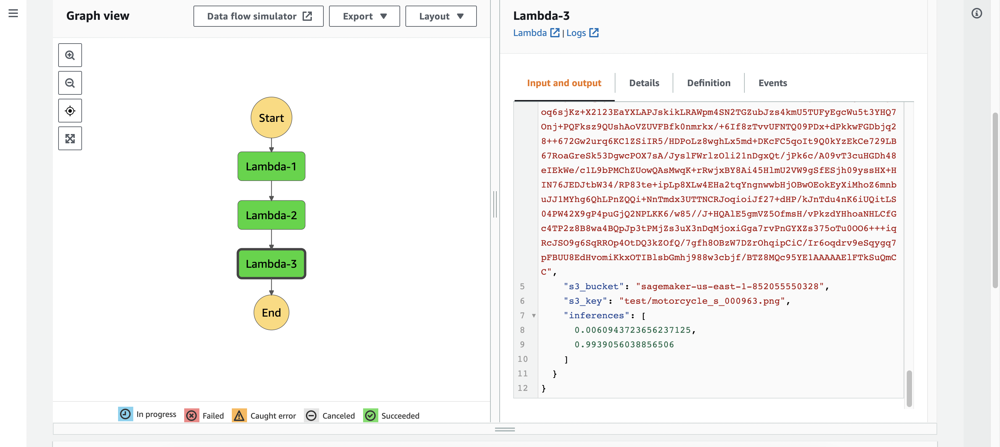
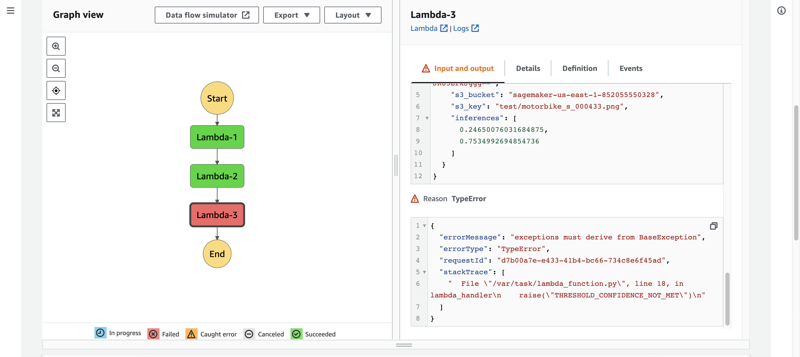
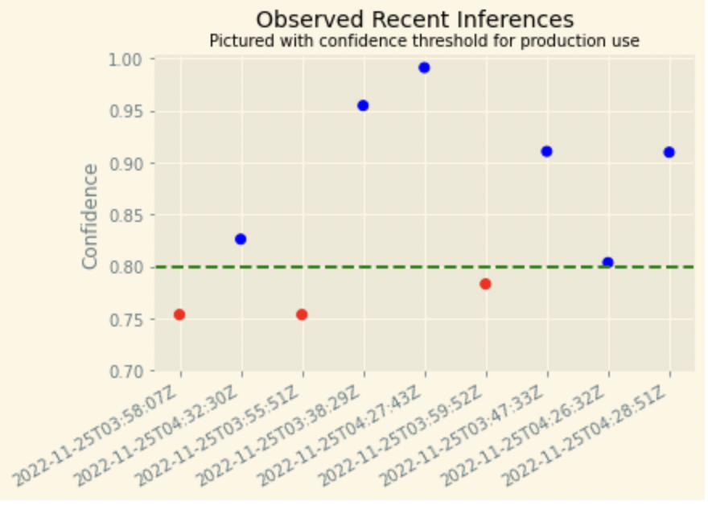
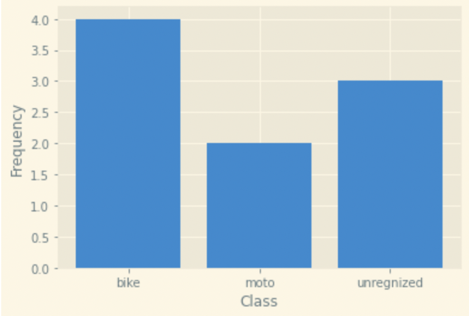
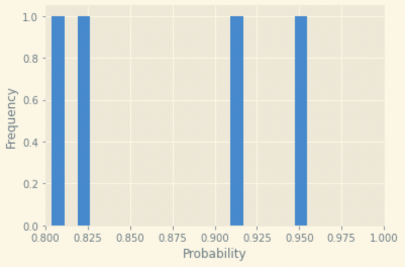
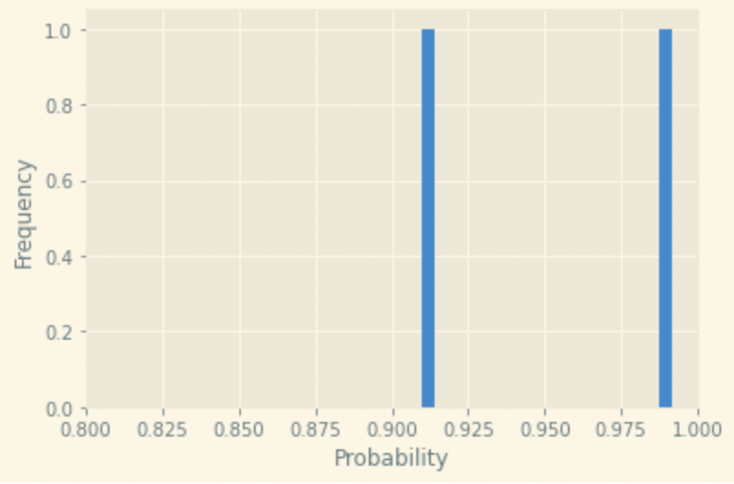

# AWS-ML-Engineer-Course-Project2
Deploy and monitor a machine learning workflow for Image Classification

## Data
We use a sample dataset called CIFAR that contains all kinds of images and extract only the images with bikes and motorcycles. In order to start working with CIFAR we'll need to:

1. Extract the CIFAR-100 dataset the University of Toronto repository https://www.cs.toronto.edu/~kriz/cifar-100-python.tar.gz 
2. Transform the data into a usable shape and format (32 x 32 x 3 array)
3. Load the data into S3.

## Model training and deployment

### Estimator
We create a Sagemaker estimator with two classes (to distinguish bikes from motorcycles) and predefined learning rate of 0.05 and mini batch size of 15. Then we train it on an `ml.p3.2xlarge` instance. The trained model acheaved 0.8 validation accuracy.

### Deployment
The model was deployed on an `ml.m5.xlarge` instance.

## Inference
In order to make inferences using the deployed endpoint, we create three lambda functions and organize them into a step function. The code of lambda functions can be found in the file [lambda.py](lambda.py)

### Lambda functions
1. Lambda 1 serializes image data. That is, the function copies an object from S3, base64 encodes it, and then returns it to the step function as an event.
2. Lambda 2 performs actual classification using the deployed model. Namely, it takes the image output from Lambda 1, decodes it, and then passes inference back to the the step function.
3. Lambda 3 filters low-confidence inferences. If the model predicts a score lower than a certain threshold (0.9 in our case), then the inference is not considered as definitive and it's not passed further.

### Step function
Using the visual editor we organize the previously defined lambda functions into a step function so that the output of Lambda 1 is the input of Lambda 2, and the output of Lambda 2 is the input of Lambda 3. The confihuration code of the step function can be found in the file [Step function](step_function.json).

Succsessful run of the step function:

Unsuccsessful run (created for testing purposes) of the step function:

### Testing
We ran the model on several input images and the below figure shows the output probabilities regardless of the predicted class.

The next figure shows the distribution between the predicted classes and also low-confidence inferences.

The last two figures show the plots of predicted probabilities in each class.

## Summary
In this project I gained experience with lambda and step functions, which is the most common tool to access deployed models.
